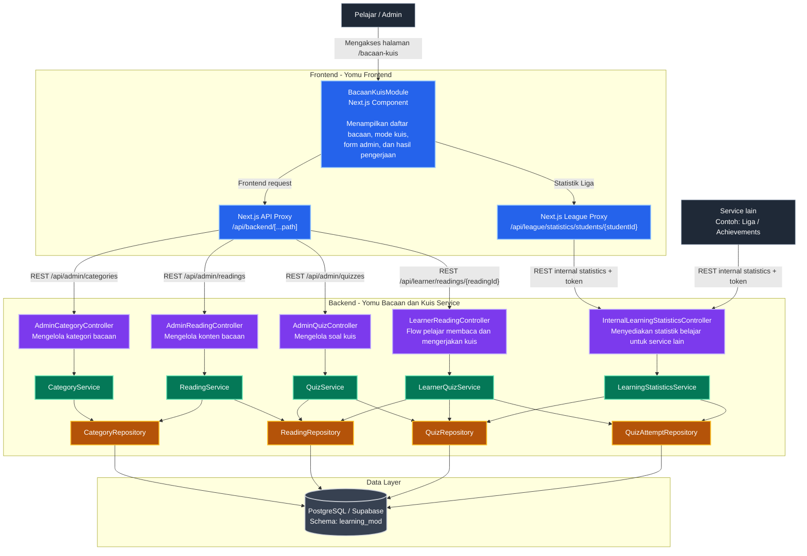
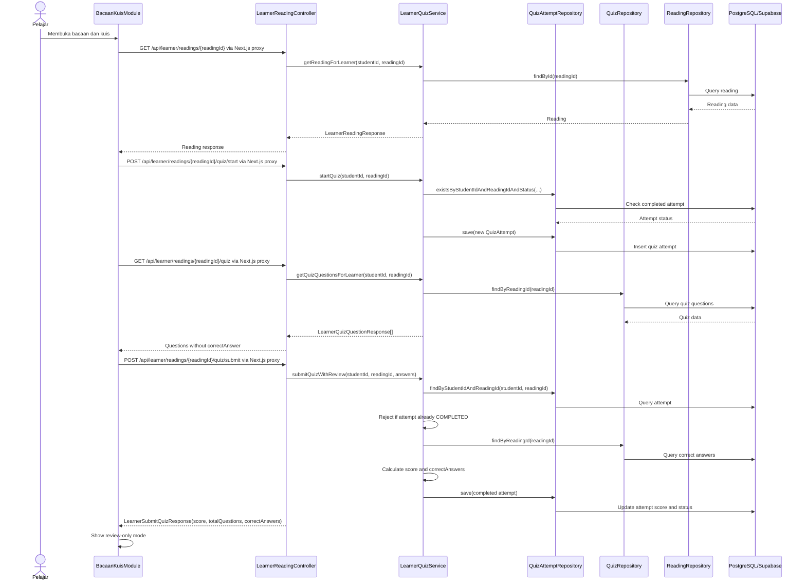
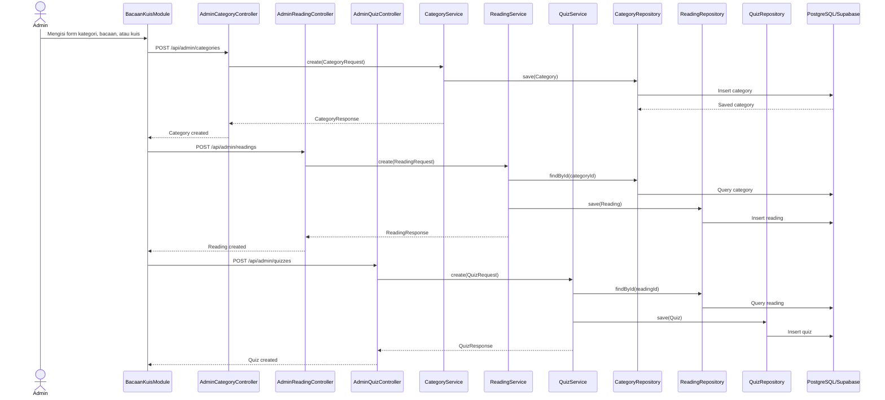
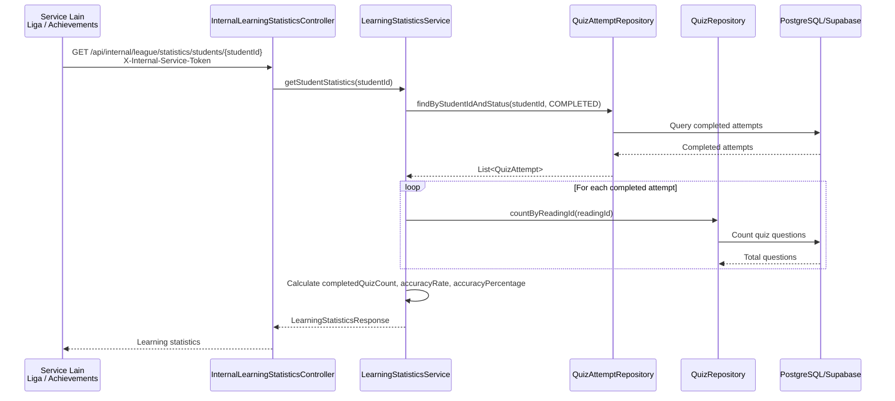

# Yomu Bacaan dan Kuis

Backend ini menangani modul Bacaan dan Kuis di Yomu. Scope utamanya adalah data kategori, bacaan, soal kuis, pengerjaan kuis oleh learner, review hasil kuis, dan statistik yang dibutuhkan modul Liga.

## Stack

- Java 21
- Spring Boot 3.4.2
- Spring Web dan Spring Security
- Spring Data JPA
- PostgreSQL/Supabase
- Actuator dan Prometheus metrics
- JaCoCo dan SonarCloud
- Fly.io untuk deployment


## Struktur Kode

```text
src/main/java/id/ac/ui/cs/advprog/yomubacaandankuis/
├─ config/          konfigurasi security, CORS, dan auth helper
├─ controller/      boundary REST API
├─ dto/             request dan response object
├─ model/           entity JPA
├─ repository/      akses database
└─ service/         business logic
```

## Diagram

### Component Diagram



### Learner Quiz Flow



### Admin Content Management Flow



### Internal Statistics Flow



## Modul Bacaan dan Kuis

Fitur utama backend:

- CRUD kategori, bacaan, dan soal kuis untuk admin.
- Flow learner untuk membuka bacaan, mulai kuis, mengambil soal, dan submit jawaban.
- Pencegahan pengerjaan ulang untuk quiz attempt yang sudah selesai.
- Response review setelah submit agar frontend dapat menampilkan jawaban benar tanpa membocorkan kunci jawaban sebelum submit.
- Statistik internal untuk akurasi, jumlah quiz selesai, total jawaban benar, dan total soal.

## Design Pattern

Kode memakai layered architecture: controller, service, repository, DTO, dan entity dipisahkan jelas. Controller hanya menangani request/response HTTP, service memegang aturan bisnis, dan repository berurusan dengan persistence.

Beberapa prinsip desain yang diterapkan:

- **Single Responsibility**: validasi request, business logic, dan akses database tidak dicampur di satu kelas.
- **Dependency Inversion**: controller dan service menerima dependency lewat constructor injection.
- **Interface-based persistence**: akses database dilakukan lewat Spring Data repository.
- **DTO boundary**: entity JPA tidak langsung menjadi kontrak API.
- **Centralized error handling**: response error ditangani melalui exception handler.

## REST API

Audit kode menggunakan REST API untuk integrasi frontend dan kebutuhan service lain. REST dipakai karena alurnya sinkron dan langsung: frontend meminta bacaan, mengambil soal, submit kuis, lalu membaca hasil/statistik.

Endpoint utama:

```text
GET    /api/admin/categories
POST   /api/admin/categories
GET    /api/admin/readings
POST   /api/admin/readings
GET    /api/admin/quizzes
POST   /api/admin/quizzes

GET    /api/learner/readings/{readingId}
POST   /api/learner/readings/{readingId}/quiz/start
GET    /api/learner/readings/{readingId}/quiz
POST   /api/learner/readings/{readingId}/quiz/submit

GET    /api/internal/league/statistics/students/{studentId}
```

Endpoint learner tidak mengirim `correctAnswer` saat soal diambil. Kunci jawaban hanya dikirim sebagai bagian dari response submit untuk kebutuhan review.

## Security

Backend menggunakan Spring Security Resource Server.

- `/api/admin/**` membutuhkan role `ADMIN`.
- `/api/learner/**` membutuhkan role `LEARNER`.
- Student ID dibaca dari claim JWT.
- `/api/internal/**` membutuhkan token internal service-to-service.
- CORS dikontrol lewat environment.
- Credential database, token internal, dan token deploy tidak disimpan di repository.

Ada mode dev auth untuk testing lokal, tetapi mode ini bukan untuk production.

## Observability dan Performance

Backend mengekspos:

```text
/actuator/health
/actuator/prometheus
```

Health endpoint dipakai untuk deployment smoke test. Prometheus metrics dipakai untuk monitoring latency, throughput, JVM, dan koneksi database.

Performance evidence yang relevan untuk modul ini:

- APDEX untuk flow learner.
- Java Flight Recorder untuk profiling backend.
- Prometheus/Grafana untuk observability.
- Lighthouse dan Clarity untuk sisi frontend.

## Deployment

Backend berjalan di Fly.io:

```text
https://yomu-bacaan-dan-kuis-b14-hanif.fly.dev
```

File deployment:

- `Dockerfile`
- `.dockerignore`
- `fly.toml`
- `.github/workflows/cd.yml`
- `.github/workflows/fly-deploy.yml`

Workflow CD melakukan deploy ke Fly.io, mengecek health endpoint setelah deploy, dan menyediakan rollback manual dari GitHub Actions.

## Konfigurasi Penting

Runtime memakai environment variable untuk koneksi database, CORS, JWT, dan token internal.

```text
DB_URL
DB_USERNAME
DB_PASSWORD
DB_SCHEMA
CORS_ALLOWED_ORIGINS
JWT_ISSUER_URI atau JWT_JWK_SET_URI
INTERNAL_SERVICE_TOKEN
SECURITY_DEV_AUTH_ENABLED
```

Frontend mengakses backend melalui proxy Next.js dengan:

```text
BACKEND_API_URL=https://yomu-bacaan-dan-kuis-b14-hanif.fly.dev
NEXT_PUBLIC_API_BASE_URL=/api/backend
```
