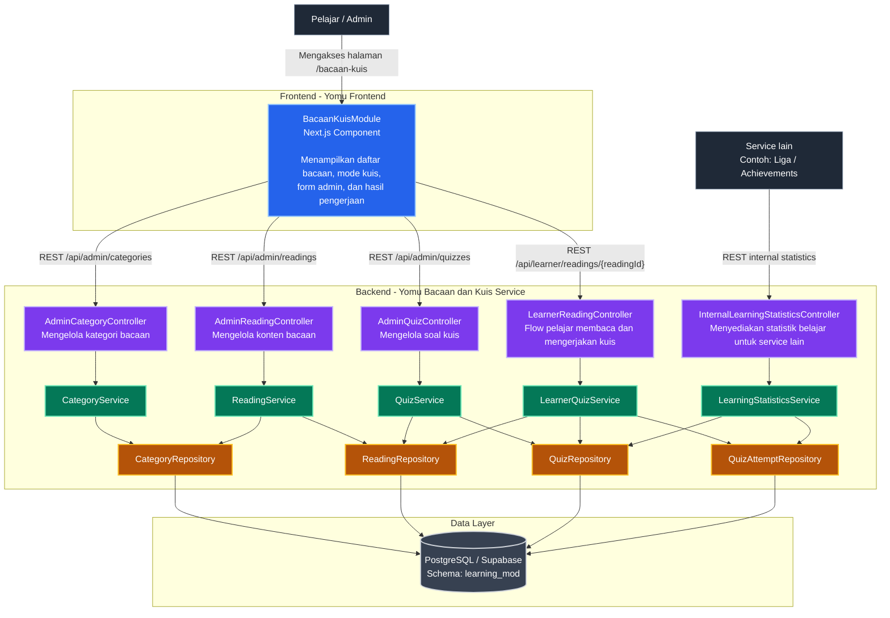
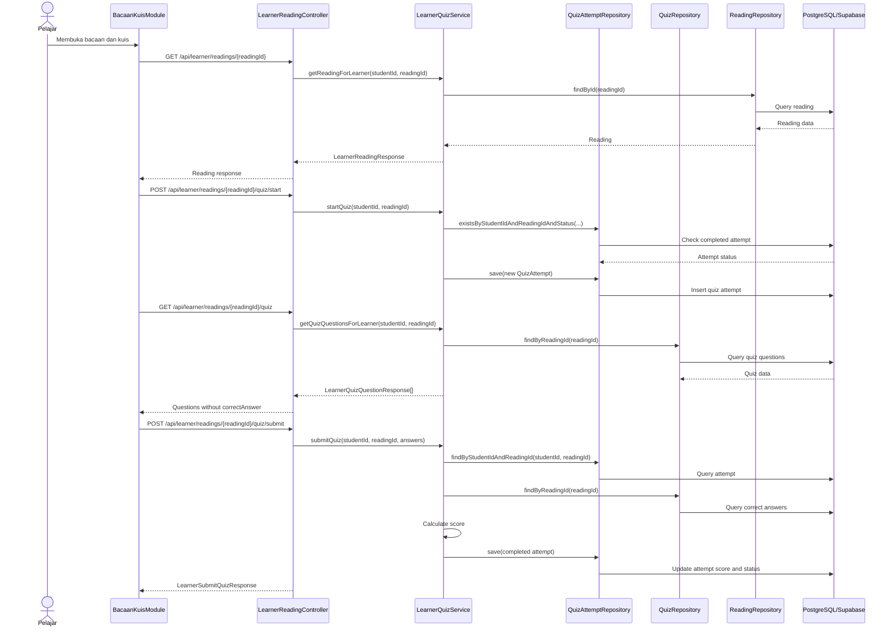
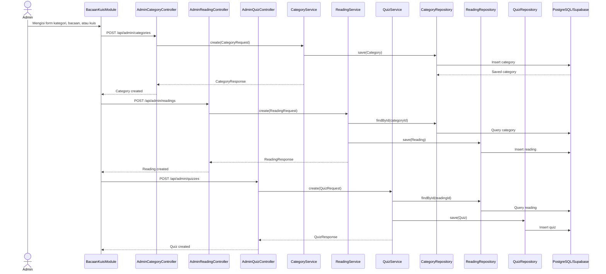
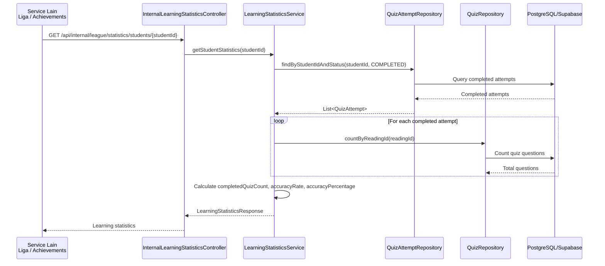

### yomu-bacaan-dan-kuis

## Individual Diagram - Bacaan dan Kuis Module

### Component Diagram

### Code Diagram - Learner Quiz Flow

Diagram ini menunjukkan alur kode ketika pelajar membaca materi, memulai kuis, mengambil soal, dan mengirim jawaban.

### Code Diagram - Admin Content Management Flow

### Code Diagram - Internal Statistics Flow

